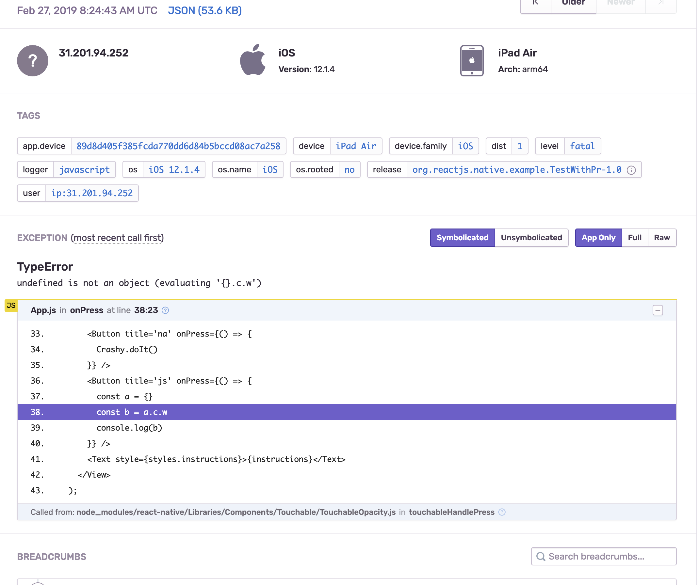
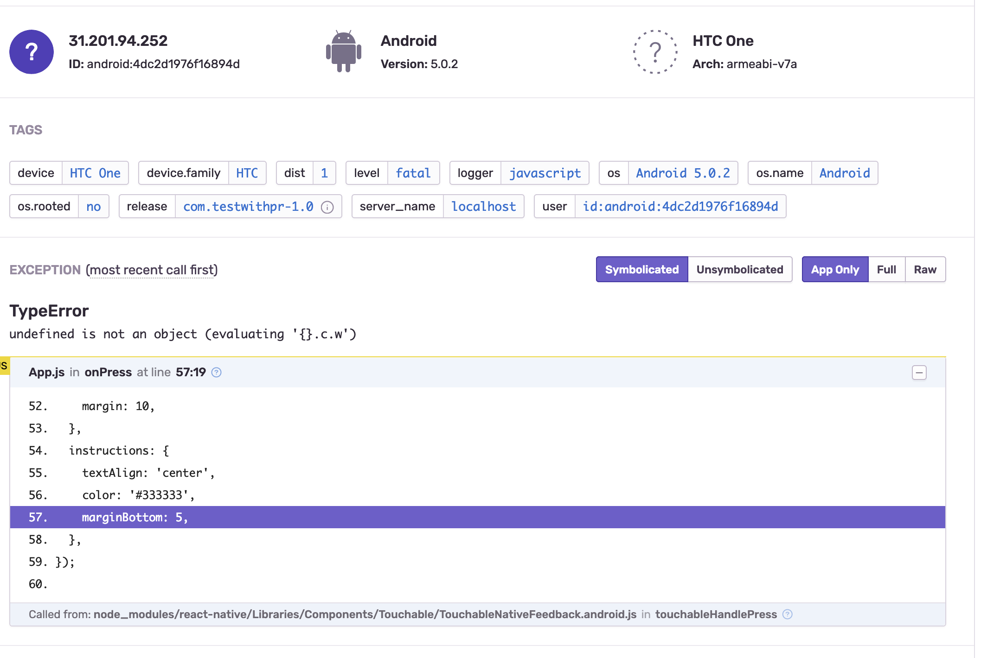

# react-native-project-with-crash-heaven-pr

The PR will contain the last 3 commits of this branch:
https://github.com/pvinis/react-native/tree/crash-reporting-heaven

The JS crash is in the `App.js` file.

The Native crashes are initialized in the `App.js` file, and they are in the `Crashy.m` for ios, and `CrashyModule.java` for android.

The results in sentry are these:

ios js:
you see the exact js line.

ios native:
you see the file and exact line (Crashy.m:20)

android js:
you see js but its off a bit 😬 https://github.com/facebook/metro/issues/148

android native:
you see the file and exact line (CrashyModule line 19)

compare these with https://github.com/pvinis/SentryBadStack
